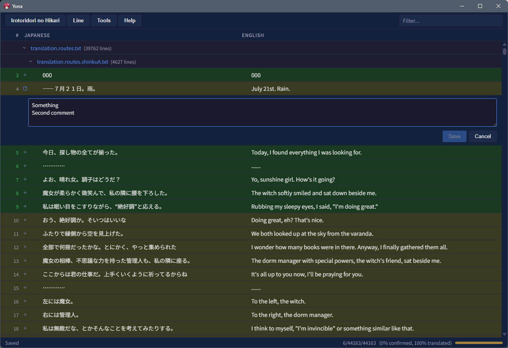
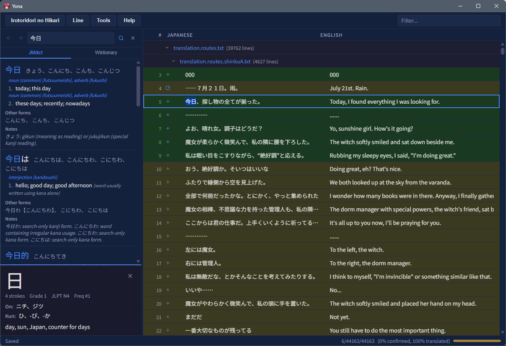
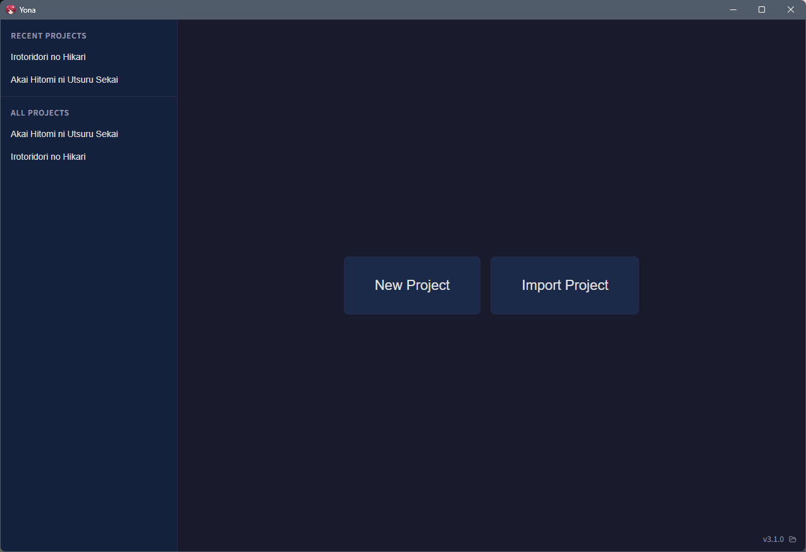
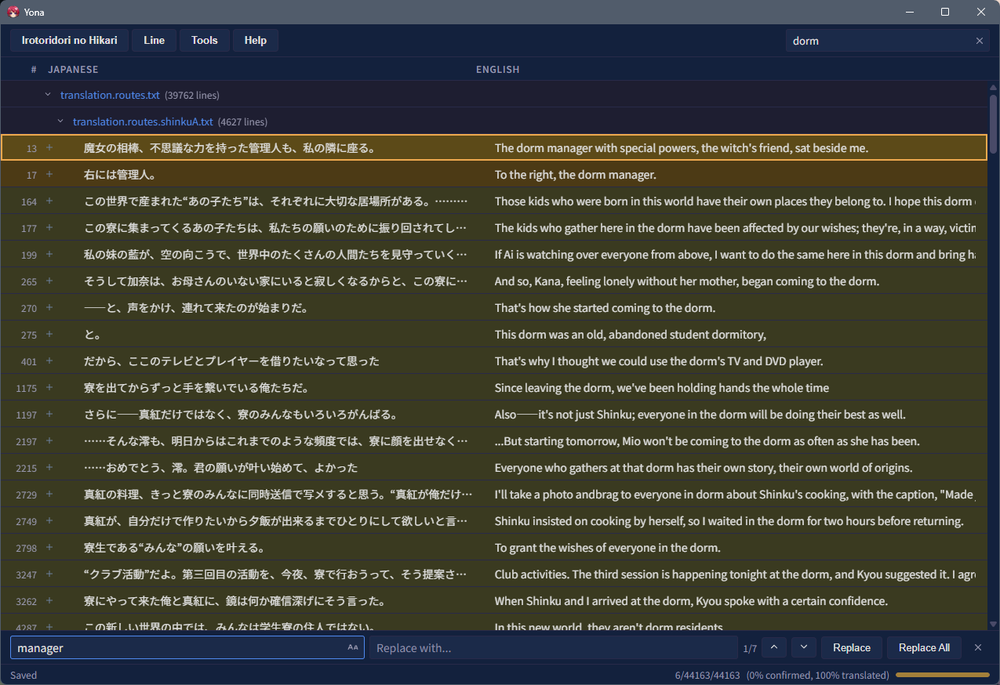

<p align="center">
  
</p>

<h1 align="center">Yona</h1>

<p align="center">
  Desktop editor for translating Visual Novel scripts with built-in Japanese dictionaries.
</p>

<p align="center">
  <a href="#features">Features</a> •
  <a href="#screenshots">Screenshots</a> •
  <a href="#download">Download</a> •
  <a href="#getting-started">Getting started</a> •
  <a href="#acknowledgments">Acknowledgments</a>
</p>

---

## Disclaimer

#### Here be dragons, or AI-slop ahead!

This project was born as an experiment to learn and get familiar with current LLMs and their capabilities.
Everything was written from scratch using Claude Code Max 5x plan and initial implementation took about 5 days.
A human in the loop has read code and directed LLM to sepcific architectural choices. In rare cases, where LLM failed,
manual code changes were implemented. Care was taken to avoid unnecessary dependencies and to keep transitive dependencies
to minimum where possible. Choice of using older versions of certain Rust libraries was explicit. Following content was
generated by LLM and minimally adjusted later on.

---

## Features

- **Side-by-side editing** - View Japanese source and English translation in a paired table, edit translations inline.
- **Translation tracking** - Three-state progress per line: untranslated, translated, and confirmed. Status bar shows overall progress at a glance.
- **Offline JMdict dictionary** - Look up any word with automatic morphological analysis (MeCab/IPADIC via vibrato). Recognizes inflected forms and links back to base entries. Results ranked by frequency.
- **Offline kanji lookup** - Click any kanji for readings, meanings, stroke count, and grade from KANJIDIC2.
- **Offline Wiktionary** - Full Japanese and English Wiktionary entries with etymologies, example sentences, synonyms, antonyms, and related terms.
- **Find & Replace** - Search across all English text with real-time match count. Navigate matches with keyboard shortcuts, replace one or all.
- **Notes** - Attach translator notes to any line.
- **Collapsible includes** - Nested script files display inline with expand/collapse.
- **Project management** - Create, import, and switch between translation projects. Recent projects for quick access.
- **Export** - Write finished translations back to the original file format.
- **Fast & lightweight** - Native Rust backend, virtualized table rendering. Handles large script files smoothly.

## Screenshots

| Editor                                         | Dictionary                                              |
|------------------------------------------------|---------------------------------------------------------|
|  |  |

| Project Home                                          | Find & Replace                                            |
|-------------------------------------------------------|-----------------------------------------------------------|
|  |  |

## Download

Download the latest release for your platform from the [Releases](https://github.com/moegebytes/editor) page.

| Platform | Format              |
|----------|---------------------|
| Windows  | `.exe`              |
| macOS    | `.dmg`              |
| Linux    | `.deb`, `.AppImage` |

## Getting started

1. **Create a project** - Click *New Project*, give it a name, and select the paired Japanese and English script files.
2. **Translate** - Double-click any English cell to edit. The Japanese source stays visible on the left.
3. **Look up words** - Select Japanese text and open the dictionary panel, or use the search bar. The JMdict and Wiktionary tabs provide complementary results.
4. **Track progress** - Double-click a row number to mark a line as confirmed (green). Use *Line -> Next Untranslated* to jump to the next unfinished line.
5. **Save & export** - *Project -> Save* stores your work. *Project -> Export* writes the translated strings back to a file.

### Keyboard shortcuts

| Shortcut | Action         |
|----------|----------------|
| `Ctrl+S` | Save           |
| `Ctrl+H` | Find & Replace |
| `Ctrl+G` | Go to Line     |
| `Ctrl+F` | Filter rows    |

## Building from source

Requires [Rust](https://rustup.rs/), [Node.js](https://nodejs.org/) ≥ 22, and [pnpm](https://pnpm.io/) (enabled via corepack).

```bash
# Install frontend dependencies
pnpm install

# Decompress resources (one-time, requires zstd)
zstd -d resources/ipadic-mecab-v270.dict.zst

# Build JMdict database (one-time)
zstd -d resources/src/JMdict_e.xml.zst
cd tools && cargo run -p build-jmdict -- \
  ../resources/src/JMdict_e.xml ../resources/gen/

# Build KANJIDIC2 database (one-time)
zstd -d resources/src/kanjidic2.xml.zst
cd tools && cargo run -p build-kanjidic -- \
  ../resources/src/kanjidic2.xml ../resources/gen/

# Build Wiktionary database (one-time)
zstd -d resources/src/enwiktionary-ja_en.jsonl.zst
cd tools && cargo run -p build-wiktionary -- \
  ../resources/src/enwiktionary-ja_en.jsonl ../resources/gen/

# Development
pnpm tauri dev

# Production build
pnpm tauri build
```

## Acknowledgments

Yona relies on the following open data sources and libraries:

### Dictionaries

- **[JMdict](https://www.edrdg.org/jmdict/j_jmdict.html)** - Japanese–English dictionary maintained by the [Electronic Dictionary Research and Development Group](https://www.edrdg.org/) (EDRDG). Licensed under [CC BY-SA 4.0](https://creativecommons.org/licenses/by-sa/4.0/).
- **[KANJIDIC2](https://www.edrdg.org/wiki/index.php/KANJIDIC_Project)** - Kanji dictionary maintained by EDRDG. Licensed under [CC BY-SA 4.0](https://creativecommons.org/licenses/by-sa/4.0/).
- **[Wiktionary](https://en.wiktionary.org/)** - Dictionary content from the Wikimedia Foundation, extracted via [wiktextract](https://github.com/tatuylonen/wiktextract). Licensed under [CC BY-SA 4.0](https://creativecommons.org/licenses/by-sa/4.0/).
- **[IPADIC](https://github.com/taku910/mecab)** - MeCab dictionary (v2.7.0) from the Nara Institute of Science and Technology. Licensed under the NAIST-2003 license.

### Key Libraries

- **[Tauri](https://tauri.app/)** - Desktop application framework (MIT/Apache-2.0).
- **[Svelte](https://svelte.dev/)** - Frontend framework (MIT).
- **[vibrato](https://github.com/daac-tools/vibrato)** - Japanese morphological analyzer (MIT/Apache-2.0).
